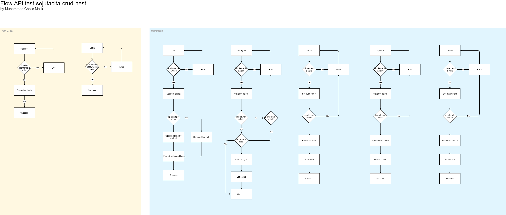

# Test SejutaCita Crud + Auth
SejutaCita test, crud + auth with NodeJS Nest Framework

## Installation

```bash
$ npm i
```

## Run

```bash
# dev
$ npm run start:dev

# prod
$ npm run start:prod
```

## Guide
- Open swagger document
  [https://localhost:3001/doc](https://localhost:3001/doc)


## Diagram


## Tech stack
- Framework - [NestJS](https://nestjs.com/)
- Database - [MongoDB](https://www.mongodb.com/)
- Cache - [Redis](https://redis.io/)

## Stay in touch
- Author - [Muhammad Cholis Malik](https://www.linkedin.com/in/mcholismalik/)
